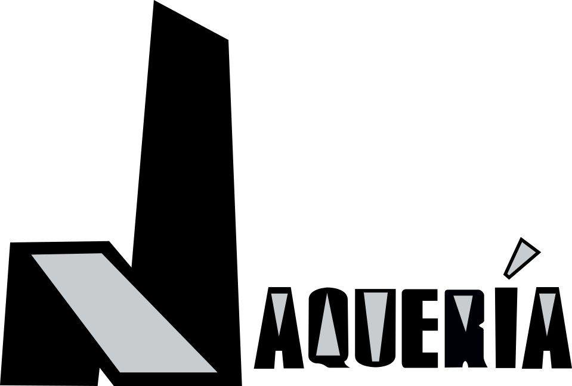

# Autor / autores

**Autor**: [La Jaquería](https://lajaqueria.org/)

**Bio**:

La Jaquería es un [hackspace](https://es.wikipedia.org/wiki/Hacklab) / makespace que se encuentra en Almería. Es decir, un espacio físico donde juntarnos para poder aprender colectivamente, tanto las unas de las otras, como juntos. Nos gusta la tecnología y creemos que es una herramienta importante para poder mejorar nuestro mundo. Pero para nosotros lo importante es el factor humano. Por eso, viéndola desde las artes y las humanidades, podemos usarla para poder mejorar nuestro mundo. Eso significa hackear, mejorar.

**Motivaciones**:

Desde La Jaquería queremos no dejes pasar la oportunidad de que compartas con el mundo un pedacito de ti. Da igual si sabes programar o no, incluso si eres un zote con la tecnología. Este recurso que te hemos preparado está pensado para ser usado por cualquier persona. Podrás tener una web, con secciones ordenadas, donde tu solo te preocupes en darle contenido y nada más.

Recuerda el dicho:

> Me lo contaron y lo olvidé; lo vi y lo entendí; lo hice y lo aprendí
> Confucio
